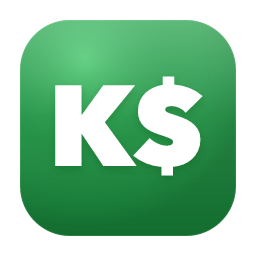
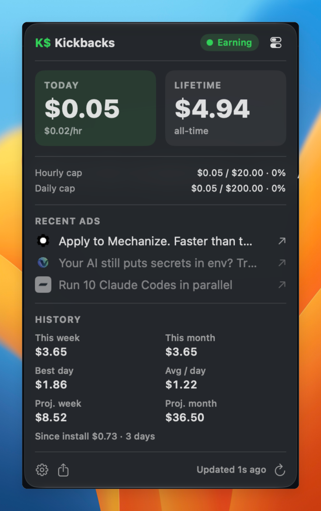
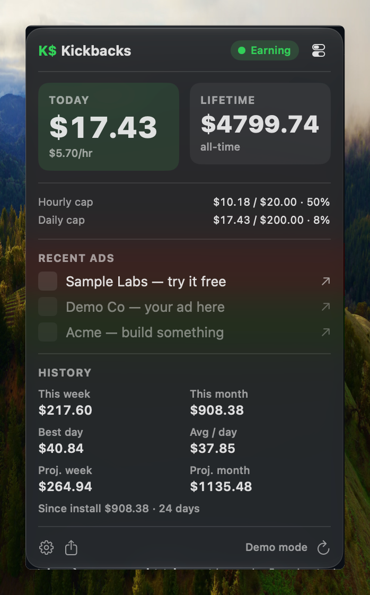
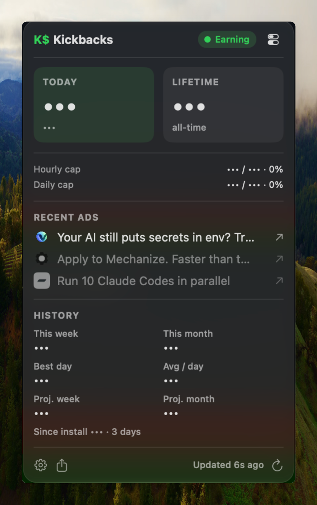
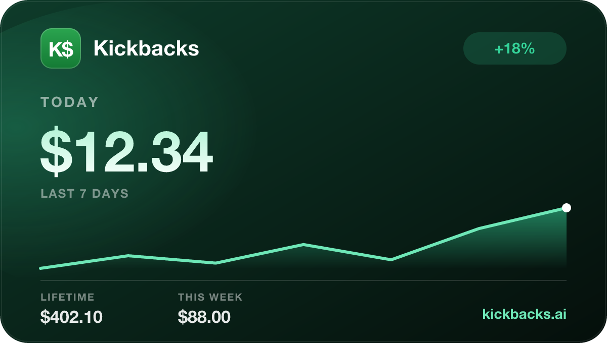
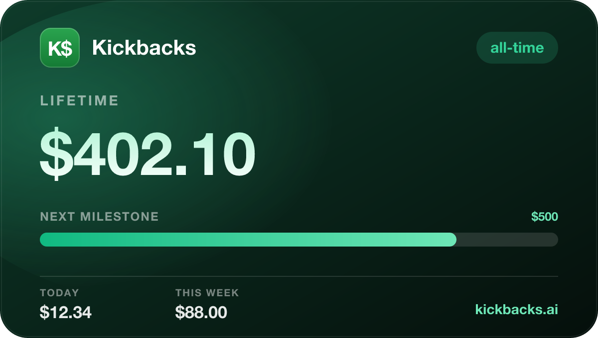

<div align="center">



# Kickbacks

**See your [Kickbacks.ai](https://kickbacks.ai) earnings without opening VS Code.**

A tiny, read-only macOS menu-bar app (plus a CLI) that keeps today's total a glance away,
remembers the history the API forgets, and gives you a heads-up if the ads quietly stop paying.

[](https://github.com/amitray007/kickbacks/actions/workflows/ci.yml)
[](https://github.com/amitray007/kickbacks/releases)
[](LICENSE)



</div>

> Not affiliated with Kickbacks.ai or ShiftKeys, Inc. Kickbacks reads only your own account
> (`GET /v1/portfolio`, `GET /v1/earnings`) and never sends a billing or impression event.
> Read-only, full stop.

## Why this exists

Kickbacks.ai pays you for ads shown while you code — but the dashboard lives inside VS Code,
and the API keeps no history. So the simple questions are oddly hard to answer: *how much did
I make this week? Is earning still working, or did it quietly break an hour ago?*

Kickbacks answers those from your menu bar, in any app, even with VS Code closed.

## What you get

- **Today, always in your menu bar.** Your running total sits up top as `K$ 12.34`. Click it for the full picture: today vs. lifetime, your hourly/daily caps, the ads you've been served, and a clean history.
- **A proper CLI.** `kickbacks` for a quick read, `kickbacks watch` for a live dashboard right in the terminal.
- **The history the API throws away.** It quietly samples into a local SQLite database, so you get this week, this month, your best day, a daily average, and where you're trending.
- **A nudge when something's off.** A background check pings you when you hit a cap or cross a lifetime milestone — no need to keep the editor open.
- **Shareable cards.** Turn today, the week, or your all-time total into a polished image worth posting.

### Built for screenshots and screen-shares

Recording a demo or pairing with someone? Flip on **Demo mode** for believable-but-fake numbers,
or **Privacy mode** to blur every dollar amount.

<table>
  <tr>
    <td align="center"><br><sub><b>Demo mode</b> — believable, fake</sub></td>
    <td align="center"><br><sub><b>Privacy mode</b> — amounts blurred</sub></td>
  </tr>
</table>

And when you want to show off a good day, the share card turns any view — today, the week, or your all-time total — into an image:

<table>
  <tr>
    <td align="center"><br><sub>Today</sub></td>
    <td align="center"><br><sub>Lifetime</sub></td>
  </tr>
</table>

## Install

It's a [Homebrew](https://brew.sh) tap that builds from source — no code-signing or notarization,
nothing to trust but the code you can read right here.

```bash
brew tap amitray007/kickbacks https://github.com/amitray007/kickbacks
brew trust amitray007/kickbacks      # one-time — Homebrew gates third-party taps
brew install kickbacks

kickbacks login                      # sign in with Google
kickbacks                            # the dashboard  ·  kickbacks watch  for the live view
kickbacks bar install                # keep the menu-bar app running at login
kickbacks poller install             # background checks + cap / milestone alerts
```

Updating later is just `brew update && brew upgrade kickbacks`. Not a Homebrew person? Clone the
repo and run `scripts/install-app.sh` — it builds a self-contained `Kickbacks.app` (the CLI tucked
inside) and drops it in `/Applications`.

## The commands

| Command | What it does |
|---|---|
| `kickbacks` | One-shot earnings dashboard |
| `kickbacks watch` | Live dashboard in the terminal (`q` to quit) |
| `kickbacks earnings` | Earnings + cap detail |
| `kickbacks status` | Where you're signed in, where data lives |
| `kickbacks login` / `logout` | Google sign-in / sign-out |
| `kickbacks poller install` | Background sampler + alerts (launchd) |
| `kickbacks bar install` | Menu-bar app at login |
| `kickbacks --version` | Print the version |

## How it works

Two tools, two languages, one shared local store:

- **`cli/`** — TypeScript on [Bun](https://bun.sh). It does all the real work: the API client, its own Google sign-in, the SQLite history, and the background poller.
- **`app/`** — a Swift `MenuBarExtra` app. It deliberately knows nothing about earnings; it just runs `kickbacks model` / `kickbacks history` and draws the result. One source of truth, in TypeScript.

They talk through the local database, never through shared code. The deeper design notes live in [docs/](docs/).

## Configuration

All optional, set via the environment:

| Variable | Default | What it's for |
|---|---|---|
| `KICKBACKS_CONFIG_DIR` | `~/.config/kickbacks` | where your tokens + history live |
| `KICKBACKS_POLL_SECONDS` | `180` | how often the background poller samples |
| `KICKBACKS_ACTIVITY_DIRS` | `~/.claude/projects` | what counts as "actively coding" |
| `KICKBACKS_BASE` | the Kickbacks backend | ⚠️ your bearer token is sent here — point it only at hosts you trust |

## Privacy & security

Read-only by design — it never writes anything back. Your tokens stay in
`~/.config/kickbacks/auth.json` on your own machine, and nothing is sent to any third party.
More in [SECURITY.md](SECURITY.md).

## Contributing

Issues and PRs are welcome — [CONTRIBUTING.md](CONTRIBUTING.md) has the build/test setup and the
one rule that matters: it stays read-only.

## License

[Apache-2.0](LICENSE). A community project — not affiliated with Kickbacks.ai / ShiftKeys, Inc.
